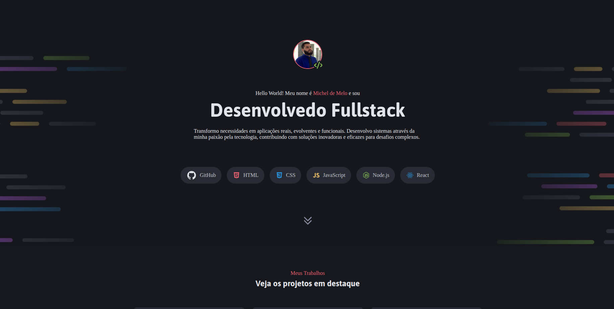
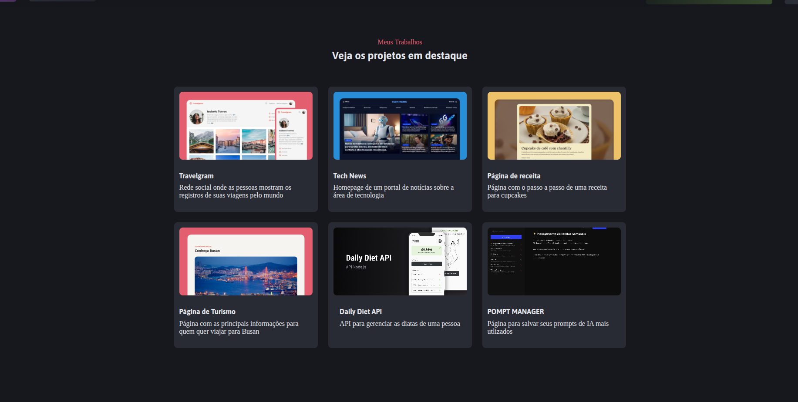
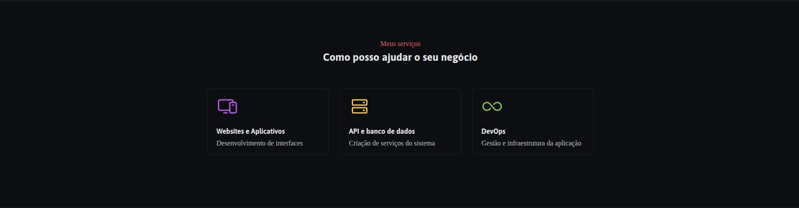
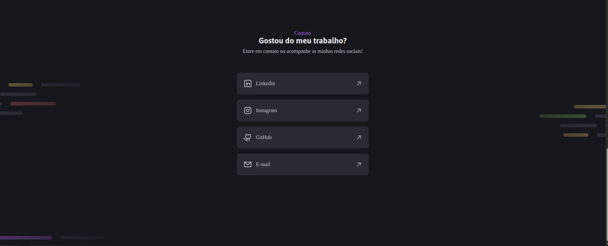

# Portfólio-DEV

Site estático (one-page) que apresenta o portfólio: introdução, trabalhos, serviços e contato.






Visão rápida:

- Principal: `index.html`
- Estilos: `styles/` (import via `styles/index.css`)
- Imagens/ícones: `assets/` (`icons/`, `imagens/`, `thumbnails/`)

Estrutura resumida:

```
index.html
styles/
assets/
README.md
```

Como abrir localmente:

```bash
abra o arquivo index.html
# ou
utilze o Live Server
```
